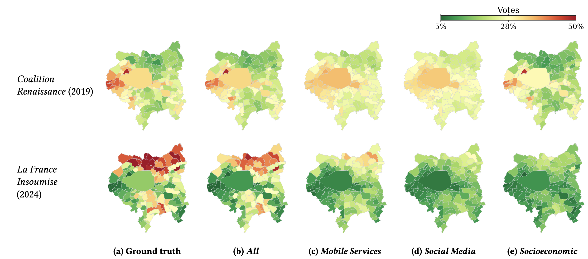

# Digital Consumption and Political Alignment: Evidence from Mobile Data Across Two European Elections in France

This repository contains the public version of the code and commune-level data for our
work presented at the [2026 ACM Internet Measurement Conference (IMC '26)](https://conferences.sigcomm.org/imc/2026/), October 12–16, 2026, Karlsruhe, Germany.

[](https://doi.org/10.1145/3777912.3839827)
[](https://conferences.sigcomm.org/imc/2026/)
[](LICENSE)
[](DATA_LICENSE)

<table>
<tr>
<td valign="top" width="55%">

**Abstract.** Understanding how digital platform consumption relates to political
alignment is paramount in contemporary democracies, yet large-scale observational
evidence across platforms and elections remains scarce. We analyze passive mobile-network
metadata from a major French operator covering roughly 31% of the market across urban and
suburban metropolitan France. Integrating demand for tens of mobile services, including
social media, news, messaging, and streaming, with socioeconomic indicators, we model
commune-level vote shares via Dirichlet regression. Digital consumption provides
independent, complementary signals of political alignment that, for several parties, match
or exceed traditional socioeconomic indicators, and combining both raises explanatory
ability substantially. Right-wing support is associated with higher Facebook and TikTok
consumption, whereas online news, Twitter, and Instagram correlate with centrist and
progressive vote. These associations are consistent across the 2019 and 2024 European
elections, giving a population-scale view of how mobile platform use relates to political
alignment.

</td>
<td valign="top" width="45%">



<sub>Predicted electoral support in the Grand Paris region for two representative parties
(Coalition Renaissance, 2019; La France Insoumise, 2024): (a) actual vote shares versus
(b)–(e) Dirichlet-regression predictions from different variable sets: all mobile
services, social media, and socioeconomic indicators. (Figure 8 in the paper.)</sub>

</td>
</tr>
</table>

## Licensing

This repository uses a dual-licensing structure to allow academic reproducibility while
preventing commercial exploitation:

* **Code:** licensed under the **MIT License combined with the Commons Clause**. Free for
  academic research and reproducibility, but explicitly prohibits commercial sale,
  hosting, or integration into commercial products. See `LICENSE`.
* **Data:** the commune-level tables in `data/` are licensed under **CC BY-NC-SA 4.0**
  (Attribution–NonCommercial–ShareAlike). Any non-commercial reuse or modification must be
  shared under the same terms. See `DATA_LICENSE`.

## Repository layout

```
.
├── settings.json        # configuration: data/image paths (relative), years, time windows
├── requirements.txt     # Python dependencies (pinned); the regression stage uses R
├── notebooks/           # the reproducible pipeline + analysis (primary, runnable form)
├── scripts/             # R Dirichlet regression (time-of-day sensitivity) + driver
├── images/              # final figure PDFs from the paper + teaser
└── data/
    ├── dirichlet/       # SHIPPED commune-level sRCA tables (the reproduction entry point)
    ├── france_shape/    # SHIPPED public boundary GeoJSON (France + city outlines)
    ├── carto/           # SHIPPED commune urban/rural classification (shapefiles: fetch note)
    ├── parties_description/  # SHIPPED party metadata + ParlGov tables
    └── dossier, elections/   # public sources, fetch notes only
```

### On the data

The upstream mobile-network traffic is **confidential operator data (under NDA)**, and we
do not release it. What we share is aggregated to the commune level: the processed sRCA
transformation of the app-level traffic volumes per commune, in
`data/dirichlet/df_data_europe_{year}_{window}.csv`. Each file has one row per commune
(INSEE code) and joins party vote shares, socioeconomic indicators, and the scaled revealed
comparative advantage (`_srca`) of each mobile service (22 services in 2019, 27 in 2024).
See `data/dirichlet/NOTE.md`. Alongside these tables we also ship the small public inputs
needed to run the analysis: commune boundary GeoJSON (`data/france_shape/`), the commune
urban/rural classification (`data/carto/communes_urban_rural.csv`), and the party metadata
and ParlGov positioning tables (`data/parties_description/`). Only the large public sources
are re-downloadable rather than committed: the INSEE dossier, the IGN commune shapefiles,
and the raw election exports. Each `data/<source>/NOTE.md` says where to get them.

## Setup

```bash
python3 -m venv .venv && source .venv/bin/activate
pip install -r requirements.txt
```

Requires Python 3.12+. The geospatial packages need system GEOS/PROJ/GDAL. The Dirichlet
regression stage runs in **R (≥ 4.0)** with the `DirichletReg` package
(`install.packages("DirichletReg")`).

## Configuration

`settings.json` holds paths (relative to the repo root) and the study constants
(`ELECTION_YEARS`, `TIME_WINDOWS`). Notebooks resolve the repo root from their own location
(they run from `notebooks/`), so a fresh clone reads and writes inside the tree with no
edits; override with the `REPO_ROOT` environment variable if needed.

## Reproducibility pipeline

Notebooks are numbered in run order. The confidential traffic-processing stages (raw
base-station traffic → per-commune service sRCA) are **not** shipped; the public pipeline
resumes at the shipped commune sRCA tables.

| # | Step | File(s) | Produces / paper artifact |
|---|------|---------|---------------------------|
| 00 | Communes + socioeconomic indicators | `notebooks/00-Communes_and_social_indicators.ipynb` | INSEE socioeconomic predictors |
| 01 | Political parties / coalitions | `notebooks/01-Political_parties.ipynb` | party spectrum (Fig. election spectrum) |
| 02 | Election results | `notebooks/02-Election_results.ipynb` | commune vote shares; ideology/polarization |
| 03 | Election × social traffic | `notebooks/03-Election_social_traffic.ipynb` | **`df_data_europe_*` tables**, sRCA + correlation figures |
| 04 | Time-of-day sensitivity (data) | `notebooks/04-Election_social_traffic_sensitivity.ipynb` | per-window tables, sensitivity heatmaps |
| 05 | Dirichlet regression (R kernel) | `notebooks/05-Dirichlet_regression.ipynb` | coefficients + predictions per predictor set |
| 06 | Sensitivity results | `notebooks/06-Dirichlet_sensitivity_results.ipynb` | AIC/BIC + time-of-day tables (App.) |
| 07 | Regression plots | `notebooks/07-Dirichlet_plots.ipynb` | coefficient plots, prediction maps, adj-R² / ρ gain |
| 08 | Sankey | `notebooks/08-Sankey.ipynb` | flow diagram |
| 09 | Gain across elections | `notebooks/09-Gain_across_elections.ipynb` | 2019→2024 change in predictive gain |
| – | Dirichlet fit stats per window (R) | `scripts/Dirichlet_regression_sensitivity.R`, `scripts/run_dirichlet_sensitivity.sh` | LogLik/AIC/BIC per (year, window) |

Notebooks 03–04 sit on the confidentiality boundary: they *produce* the shipped tables
from the NDA traffic, but their downstream plotting cells run on the shipped tables.
Notebooks 00–02 run from the public re-downloads (see the `data/*/NOTE.md` files).

## Reproducing results

- **Inspect only.** Browse the notebooks and the figure PDFs in `images/`. No compute needed.
- **From the shipped data (the main path).** Install R and `DirichletReg`, then run notebook
  `05` (and `scripts/` for the time-of-day sensitivity) on `data/dirichlet/df_data_europe_*`
  to regenerate the coefficients and predictions. Then run `06`, `07`, and `09` for the
  figures and tables. The regression outputs are regenerated, not shipped.
- **From public sources.** Re-download the INSEE, IGN, Ministry, and ParlGov inputs named
  in `data/*/NOTE.md`, then run `00` to `02` to rebuild the socioeconomic and electoral
  columns. The official commune-level European-election results are on data.gouv.fr:
  [2019](https://www.data.gouv.fr/datasets/resultats-des-elections-europeennes-2019?resource_id=cac2692c-67af-4bcb-9921-eca33e7f1ead)
  and [2024](https://www.data.gouv.fr/datasets/resultats-des-elections-europeennes-du-9-juin-2024?resource_id=ed34e007-582b-4108-b117-25ab138ec33e).
- **Upstream (confidential).** The raw-traffic to sRCA stages are not reproducible from
  this repository, because the operator traffic is under NDA.

## Citation

```bibtex
@inproceedings{martinezdurive2026digital,
  author    = {Mart\'inez-Durive, Orlando E. and \'Ucar, I\~naki and Smoreda, Zbigniew and Moro, Esteban and Fiore, Marco},
  title     = {Digital Consumption and Political Alignment: Evidence from Mobile Data Across Two European Elections in France},
  booktitle = {Proceedings of the 2026 ACM Internet Measurement Conference (IMC '26)},
  year      = {2026},
  location  = {Karlsruhe, Germany},
  publisher = {Association for Computing Machinery},
  address   = {New York, NY, USA},
  doi       = {10.1145/3777912.3839827}
}
```

## License

Code: [MIT + Commons Clause](LICENSE). Data: [CC BY-NC-SA 4.0](DATA_LICENSE).
